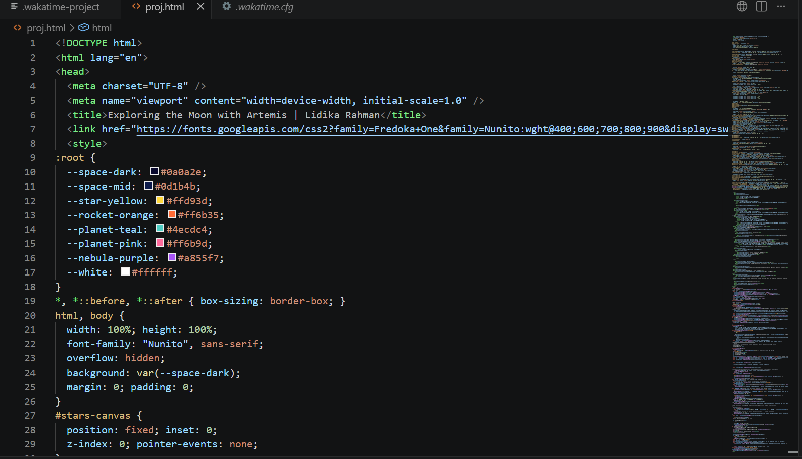

# Exploring the Moon with NASA's Artemis Mission

An interactive, educational web application built from scratch to showcase NASA's Artemis program and the future of lunar exploration.

##  Live Demo
You can view the live, working website here: 
👉 [https://lidikarahman2023.github.io/moon-exploration-artemis/](https://lidikarahman2023.github.io/moon-exploration-artemis/)

---

##  Quick Start
1. Click the **Live Demo** link above.
2. Click the **"Continue as Guest"** button on the welcome page to jump straight into the exploration platform instantly!
3. (Optional) Feel free to use the registration form to create a test account and explore the application's underlying authentication mechanics.

---

##  Features & Tech Stack
* **Interactive Lunar UI:** Responsive design elements and custom font choices creating an immersive space-themed visual hierarchy.
* **Core Mission Insights:** Structured sections detailing milestones of the SLS Rocket, Orion Spacecraft, and future lunar landings.
* **Authentication Mechanics:** A fully functional user signup and login system built natively using HTML, CSS, and JavaScript.
* **Frictionless Guest Access:** Zero forced barriers—voters can bypass the credential gate with a single click.

---

##  How to Run This Project Locally

If you want to view or edit the source code on your local machine, follow these steps:

### Prerequisites
Make sure you have Google Chrome (or any modern web browser) installed.

### Execution Steps
1. Clone or download this repository to your local machine.
2. Open the project folder inside your code editor (like Visual Studio Code).
3. Open the `index.html` file.
4. Select **Run without debugging** from your editor's menu, choose **Chrome**, and the site will instantly launch a local preview in your browser!* **To test the mechanics:** Feel free to use the registration form to create a temporary account!

---

##  How to Run This Project Locally

If you want to view or edit the source code on your local machine, follow these steps:

### Prerequisites
Make sure you have Google Chrome (or any modern web browser) installed.

### Execution Steps
1. Clone or download this repository to your local machine.
2. Open the project folder inside your code editor (like Visual Studio Code).
3. Open the `index.html` file.
4. Select **Run without debugging** from your editor's menu, choose **Chrome**, and the site will instantly launch a local preview in your browser!
