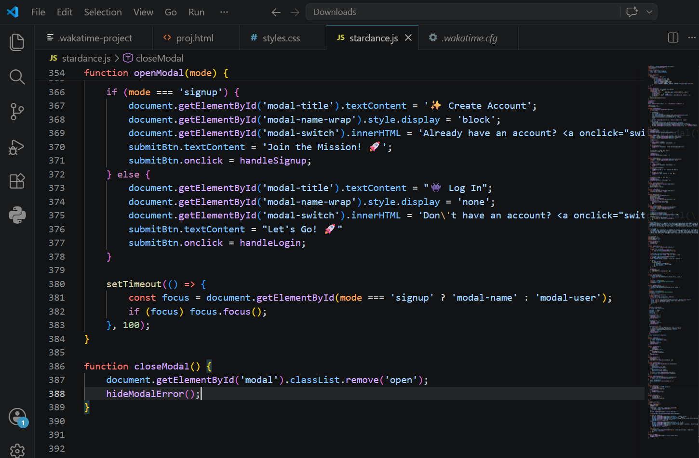

# Exploring the Moon with NASA's Artemis Mission

An interactive, educational web application built from scratch using HTML ,CSS and JS to showcase NASA's Artemis program and the future of lunar exploration.

## Live Demo
You can view the live, deployed website here: 
👉 [https://lidikarahman2023.github.io/moon-exploration-artemis/](https://lidikarahman2023.github.io/moon-exploration-artemis/)

---

##  Preview
Below is a preview screenshot of the completed web design:

---
---

## Accessing the Site
This project includes a user authentication system to demonstrate core web mechanisms. 

* **To explore instantly:** Click the **"Continue as Guest"** button on the welcome page to jump straight into the Artemis mission content.
* **To test the mechanics:** Feel free to use the registration form to create a temporary account!

---

##  How to Run This Project Locally

If you want to view or edit the source code on your local machine, follow these steps:

### Prerequisites
Make sure you have Google Chrome (or any modern web browser) installed.

### Execution Steps
1. Clone or download this repository to your local machine.
2. Open the project folder inside your code editor (like Visual Studio Code).
3. Open the `index.html` file.
4. Select **Run without debugging** from your editor's menu, choose **Chrome**, and the site will instantly launch a local preview in your browser!
